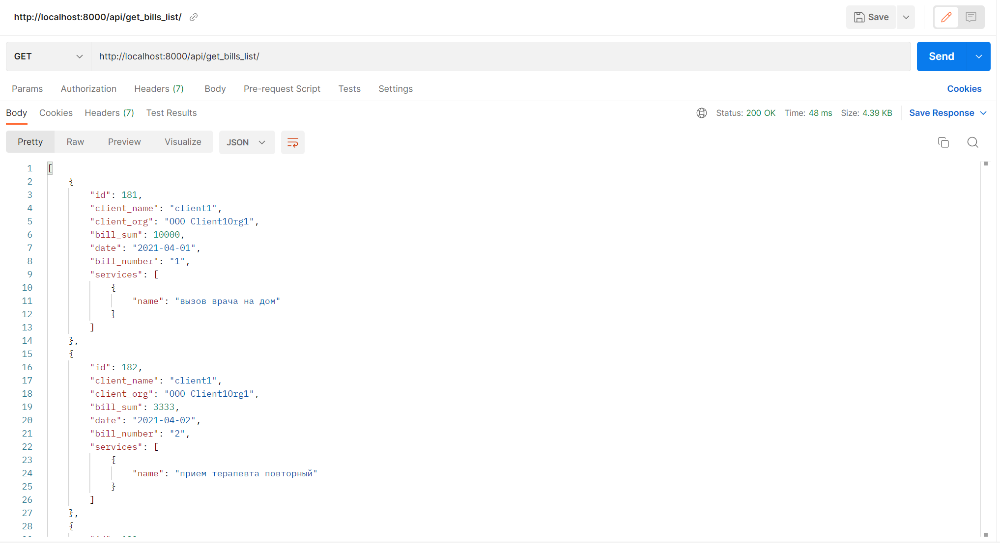
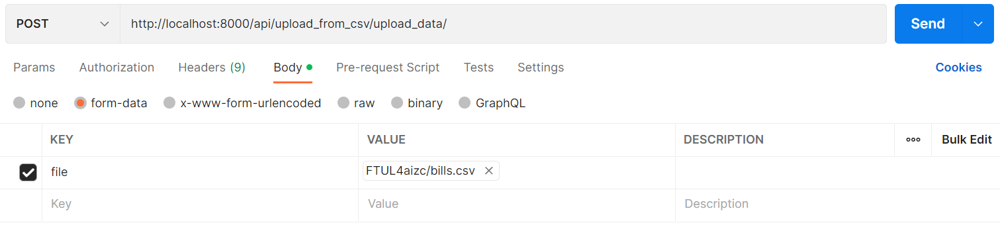
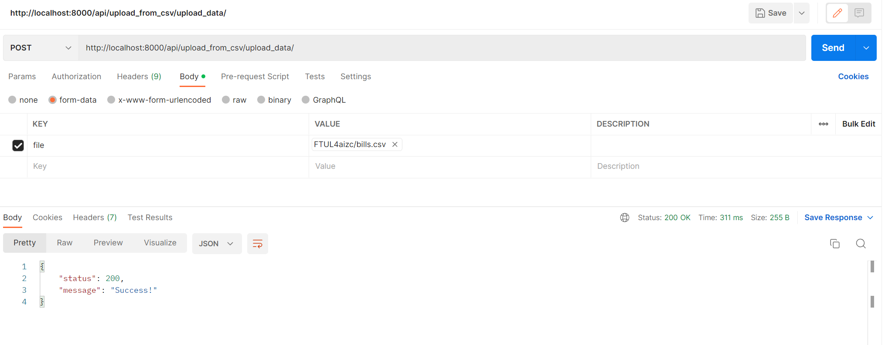

# Bills API


___
## Описание проекта
API разработан для взаимодействия со счетами мед. учреждений :man_health_worker:.
___
### Стек

Основной стек, используемый в проекте:

- [X] Python >=3.8
- [X] Django==2.2
- [X] djangorestframework==3.13.1
- [X] django-filter==21.1
- [X] БД SQLite
___
### Модели в БД

- Клиент (пациент) :raising_hand_woman:
- Организация (Мед. учреждение) :hospital:
- Услуга(и) :white_check_mark:
- Счет :bookmark_tabs:
___
### Методы

Предусмотрены следующие endpoints для данного API:

- [GET] для получения всех счетов с возможностью фильтрации по клиенту и/или организации `http://localhost:8000/api/get_bills_list/`;
- [POST] для загрузки счетов из csv файла в БД  `http://localhost:8000/api/upload_from_csv/upload_data/`.

При POST запросе структура csv файла должна иметь следующий вид:

| client_name | client_org  | №*  | sum** | date   | service   |
| ------- | --- |-----|-------|----|----|
| client1 | Client1Org1 | 1   | 1000  |  01.04.2021  |  вызов врача на дом  |

Примечания:

:pushpin: *номер счета

:pushpin: **сумма счета

в БД записываются только валидные данные.
Данные валидны, если выполнены нижеприведенные условия:

- значение `sum` является числом;
- значение `service` не равно `NULL` или `“-”`;
- значение `date` валидно (содержит день, месяц и год);
- значение `№` имеет тип integer;
- значения `client_name` и `client_org` не равны `NULL`.

Номер счета (№) уникален для client_name и client_org (к примеру, OOO Client1Org1 клиента client1 не может иметь более одного счета с № 1).
___
## Установка зависимостей
Сначала необходимо создать виртуальное окружение с помощью следующей команды:

`python -m venv env`

После активации виртуального окружения воспользуйтесь командой ниже для установки необходимых зависимостей:

`pip install -r requirements.txt`

Файл `requirements.txt` расположен в корне проекта.
___
## Настройка

Необходимо в директории `bills_api` создать файл `.env` и поместить туда следующий код:

`SECRET_KEY=&xjf6z8!=jjnvqag)!&@(!t^pr_#bj83y6(t2x95p#4)zoj@ng`

Это секретный ключ, который создается в django проекте по умолчанию.

Далее следует внести следующие корректировки в файле `bills_api/service.py`:

```py
import environ

env = environ.Env()
environ.Env.read_env()

SECRET_KEY = env('SECRET_KEY')
```

В случае, если в рамках работы сервиса необходимо скрыть чувствительную информацию от пользователей, следует исправить значения следующих параметров, как показано ниже:

```py
DEBUG = False

ALLOWED_HOSTS = ['127.0.0.1']
```
---
## Тестирование

Тестирование рекомендуется проводить, используя сервис https://www.postman.com/.

### Тестирования GET запроса

Для тестирования endpoin'а с целью получения всех счетов создайте запрос и введите следующий url:
`http://localhost:8000/api/get_bills_list/`



Для получения отфильтрованных значений:

По имени клиента:

:arrow_left:`http://localhost:8000/api/get_bills_list/?client=client1`

По наименованию организации:

:arrow_left:`http://localhost:8000/api/get_bills_list/?client_org=OOO Client2Org1`

По 2 параметрам:

:arrow_left:`http://localhost:8000/api/get_bills_list/?client_name=client2&client_org=OOO Client2Org1`

### Тестирования POST запроса

Для загрузки записей в БД из csv файла укажите url `http://localhost:8000/api/upload_from_csv/upload_data/`.



В теле запроса нажмите `form-data`, в значении `key` укажите `file`, далее выберите файл (см. рисунок выше).



В случае положительного ответа загруженный файл сохранится в директории `bills_api/tmp`.
___


